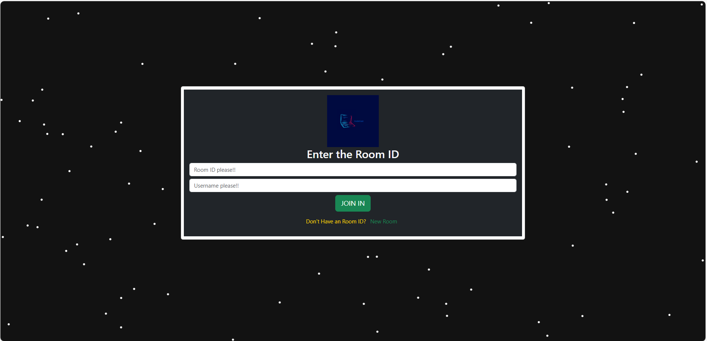

hello all!

About:
A real-time collaborative coding platform that allows multiple users to write, edit, and share code together seamlessly. Built with React.js, Socket.io, and Bootstrap.

Its features include:

👥 Multi-user collaboration in real-time
⚡ Instant synchronization using WebSockets (Socket.io)
🌐 Room-based collaboration with unique IDs
🖥️ Interactive code editor (with syntax highlighting)
🎨 Responsive design with Bootstrap
🔗 Shareable room links for collaboration

The tech stack I have used is:

Frontend: React.js,Bootstrap
Backend: Node.js,Express.js
Real-time communication: Socket.io
Editor: CodeMirror 

Usage:

1. Create or join a room.
2. Share the room ID with collaborators.
3. Start coding together in real-time.

Screenshots of the Web :

Future Enhancements

Support for multiple programming languages.
Real-time code execution and output.
Authentication and user profiles.
Integrated chat/voice/video collaboration.